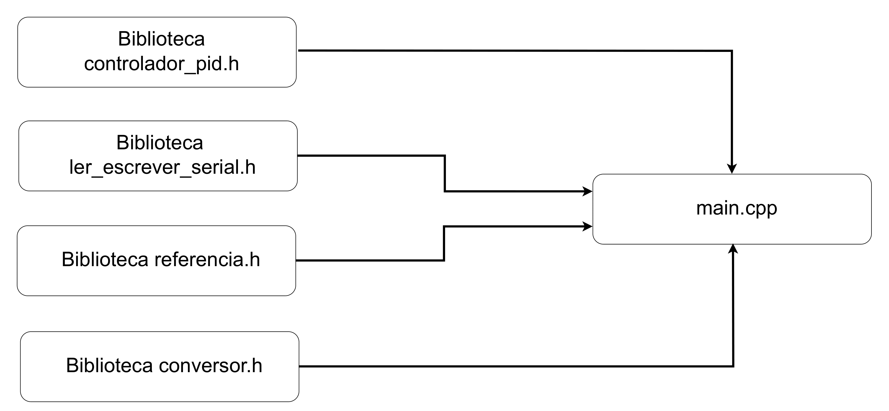
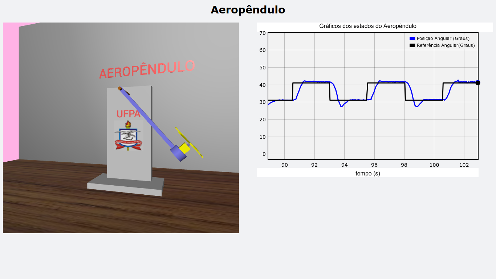

<p align="center">
  
  
</p>

<p align="center">
   &
  
</p>

<p align="center">
    <a href="#protótipo">Protótipo</a>
  • <a href="#interface-gráfica">Interface gráfica</a> 
  • <a href="#firmware">Firmware</a>
  • <a href="#gêmeo-digital">Gêmeo Digital</a>
</p>

<h3  id="techs">Tecnologias</h3>

<p align=center>     
  </ul>
  <br>
</p>

<h1 align=center>Trabalho de Conclusão de Curso [ Oséias Farias ]</h1>


<p align=center> <i><strong>Tema: Identificação de Sistemas, Simulador Gráfico e Prototipagem de um Aeropêndulo para estudos de Projetos de Controle</strong></i></p>

```
.
├── docs
├── materiais_complementares
├── mkdocs.yml
├── README.md
├── revisao_tcc
├── site
├── softwares_aeropendulo
└── utils
```

O projeto inclui 4 partes, sendo elas:

## Protótipo

Implementa um aeropêndulo real, pode ser usado para estudos e testes de controladores e identificação de sistemas etc.

<br>

<p align="center">
  
</p>


## Interface gráfica

Usada para iteragir em tempo real com o protótipo, esse sistema plotado os gráficos da posição angular, erro, sinal de referência, sinal PRBS e sinal de controle em malha fechada.

<p align="center">
  
</p>

<p align="center">
  
</p>

## Firmware

Aplicação para o microcontrolador com finalidade de desenvolver as funcionalidades de comunicação com a interface gráfico do computador e implementar controlador para o sistema em malha fechada, além disso, o usuário pode incrementar outras funcionalidades.

<p align="center">
  
</p>


## Gêmeo Digital

Usa o sinal de saída (ângulo) para realizar a dinâmica do sinulador.
<br>

<p align="center">
  
</p>  
