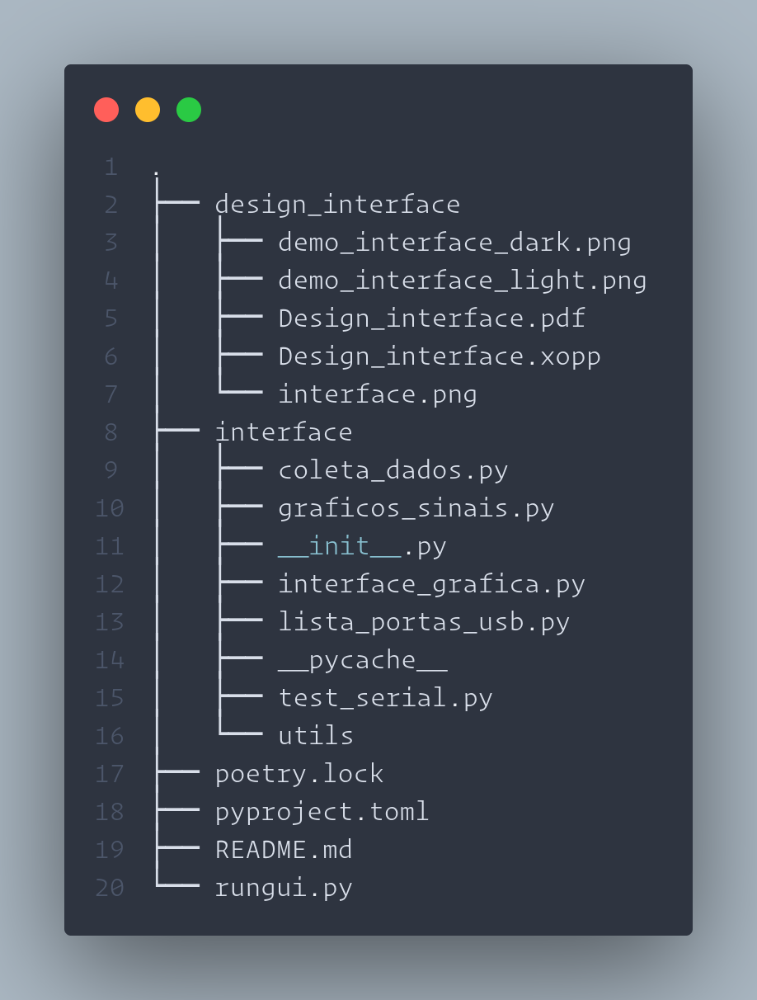

# Trabalho de Conclusão de Curso [ Oséias Farias ]

### Identificação de Sistemas, Simulador Gráfico e Prototipagem de um Aeropêndulo para estudos de Projetos de Controle

  

## Interface Aeropêndulo

### Estrutura do Projeto

## Protótipo Aeropêndulo

 

   

  

## Simulador Aeropêndulo

 

   

