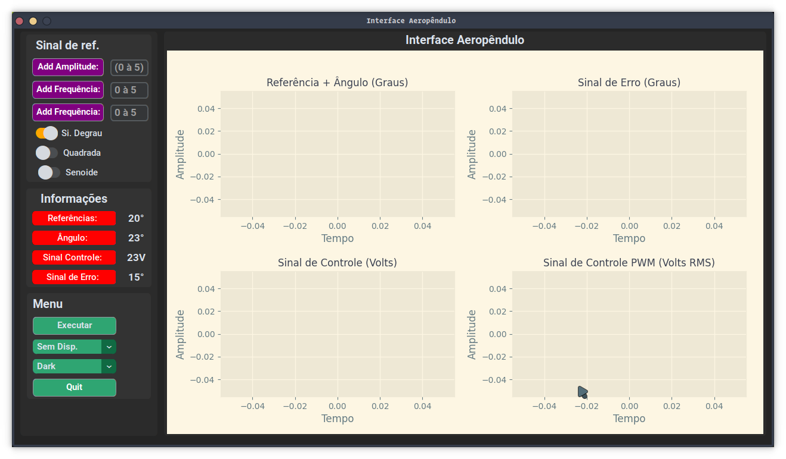

# Trabalho de Conclusão de Curso [ Oséias Farias ]


### Identificação de Sistemas, Simulador Gráfico e Prototipagem de um Aeropêndulo para estudos de Projetos de Controle

<br><br>

<center>
   
<center/>

<br><br>

## Interface Aeropêndulo

### Estrutura do Projeto da Interface Gráfica

```
.
├── design_interface
│   ├── demo_interface_dark.png
│   ├── demo_interface_light.png
│   ├── Design_interface.pdf
│   ├── Design_interface.xopp
│   └── interface.png
├── interface
│   ├── coleta_dados.py
│   ├── graficos_sinais.py
│   ├── __init__.py
│   ├── interface_grafica.py
│   ├── lista_portas_usb.py
│   ├── __pycache__
│   ├── test_serial.py
│   └── utils
├── poetry.lock
├── pyproject.toml
├── README.md
└── rungui.py
```




## Protótipo Aeropêndulo

<br>
## Simulador Aeropêndulo

<br>

<center>
   
<center/>
