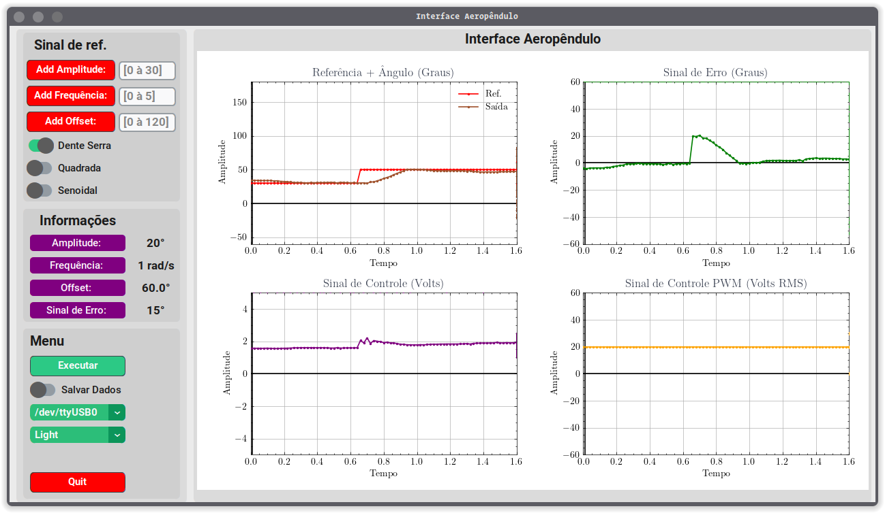

# Trabalho de Conclusão de Curso [ Oséias Farias ]


### Identificação de Sistemas, Simulador Gráfico e Prototipagem de um Aeropêndulo para estudos de Projetos de Controle

O projeto inclui 4 partes, sendo elas:

> + Potótipo

Implementa um aeropêndulo real, pode ser usado para estudos e testes de controladores e identificação de sistemas etc.

> + Interface gráfica

Usada para iteragir em tempo real com o protótipo, esse sistema plotado os gráficos da posição angular, erro, sinal de referência, sinal PRBS e sinal de controle em malha fechada.

> + Firmware

Implementa o controlador, envio e recebimento de dados inteface gráfica / microcontrolador, geração de sinal de referência, leitura do sensor potenciômetro.

> + Gêmeo Digital

Usa o sinal de saída (ângulo) para realizar a dinâmica do sinulador.

<br><br>


## Protótipo Aeropêndulo

<br>

<center>
   
<center/>

<br><br>

## Interface Aeropêndulo

### Estrutura do Projeto da Interface Gráfica

```
.
├── design_interface
│   ├── demo_interface_dark.png
│   ├── demo_interface_light.png
│   ├── Design_interface.pdf
│   ├── Design_interface.xopp
│   └── interface.png
├── interface
│   ├── coleta_dados.py
│   ├── graficos_sinais.py
│   ├── __init__.py
│   ├── interface_grafica.py
│   ├── lista_portas_usb.py
│   ├── __pycache__
│   ├── test_serial.py
│   └── utils
├── poetry.lock
├── pyproject.toml
├── README.md
└── rungui.py
```




## Firmware do Aeropêndulo

Aplicação para o microcontrolador com finalidade de desenvolver as funcionalidades de comunicação com a interface gráfico do computador e implementar controlador para o sistema em malha fechada, além disso, o usuário pode incrementar outras funcionalidades.


## Simulador Aeropêndulo - (Gêmeo Digital)

<br>

<center>
   
<center/>
