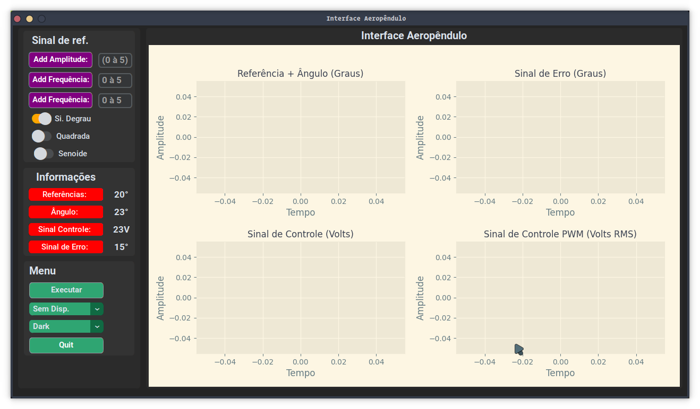
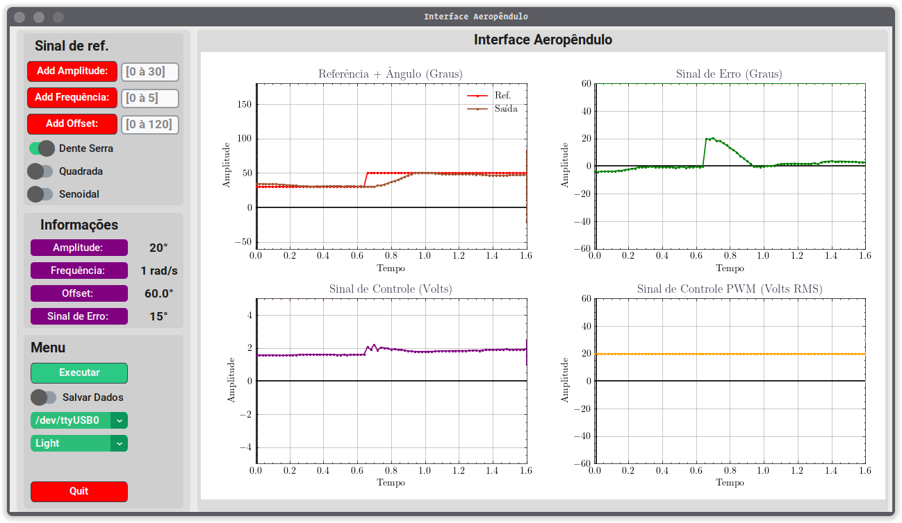

# Interface Gráfica Aeropêndulo

### Descrição

Inteface para plotagem dos gráficos dos estados do sistema.

    
  
Figura 1 - Design Interface Aeropêndulo.

    
  
Figura 1 - Design Interface Aeropêndulo.

