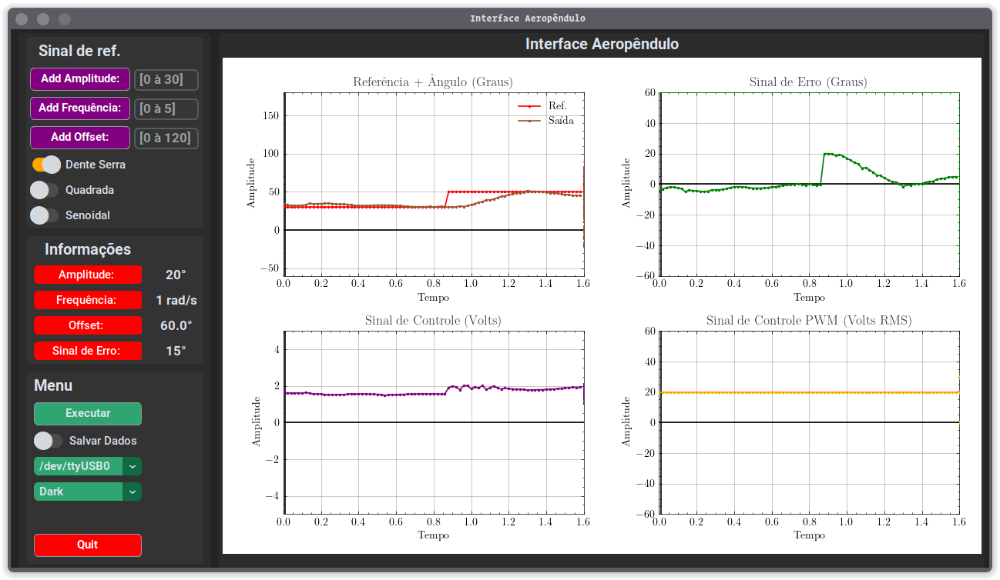
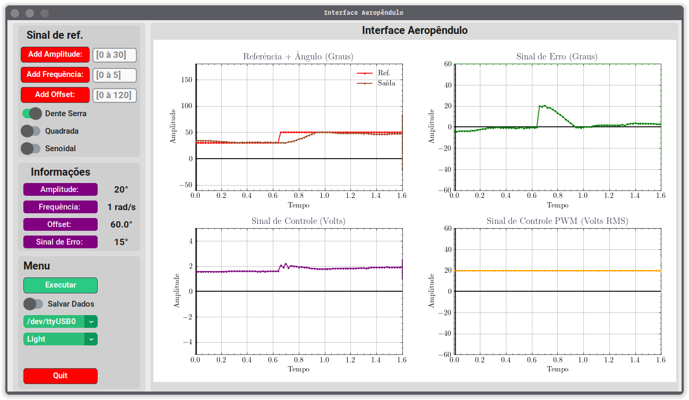
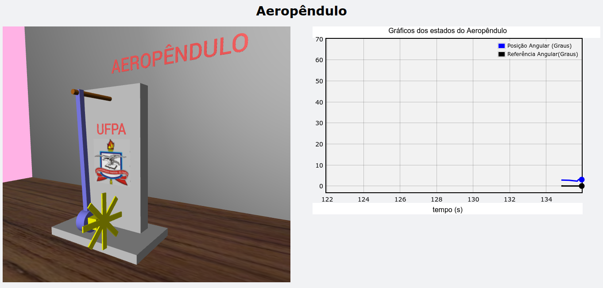

# Interface Gráfica de Usuário Aeropêndulo

### Descrição

Inteface para plotagem dos gráficos dos estados e configuração do sistema em tempo real.

    
  
Figura 1 - Design Interface Aeropêndulo.

    
  
Figura 2 - Design Interface Aeropêndulo.

 

---

 

# Interface do Gêmeo Digital

    
  
Figura 3 - Interface do Gêmeo Digital.

